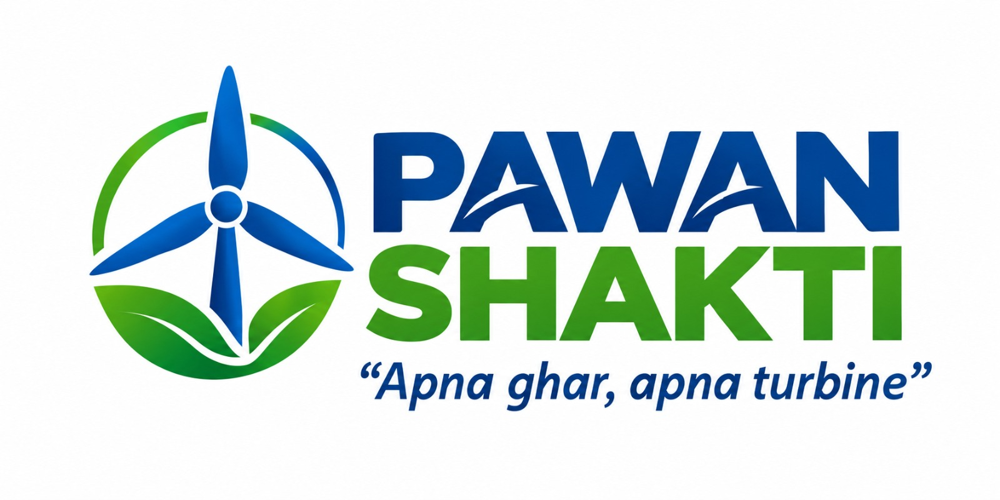
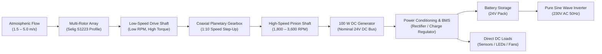
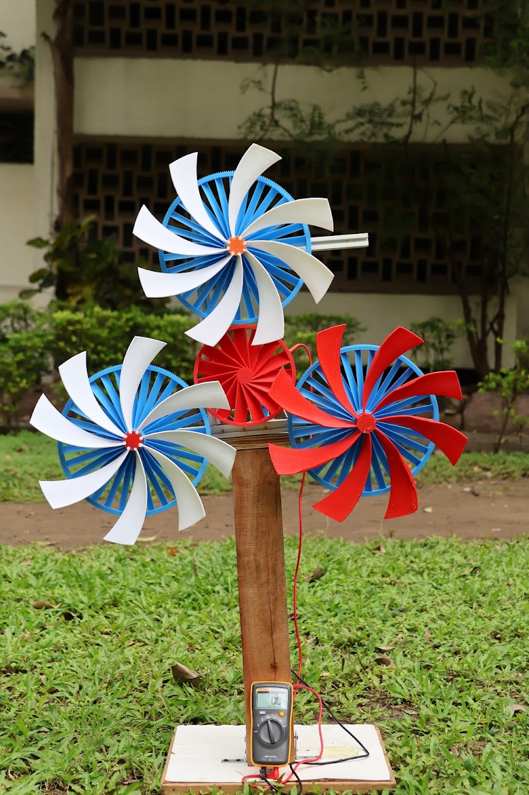
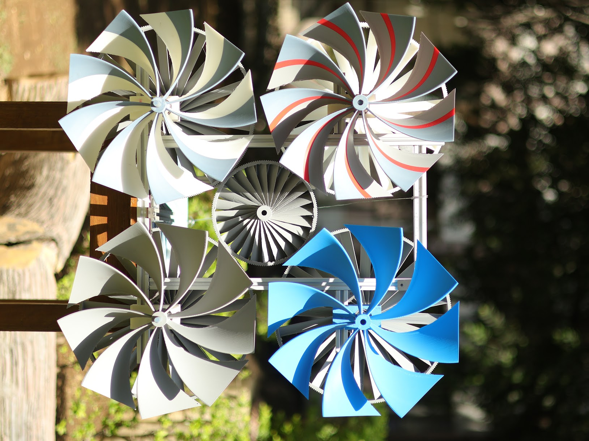
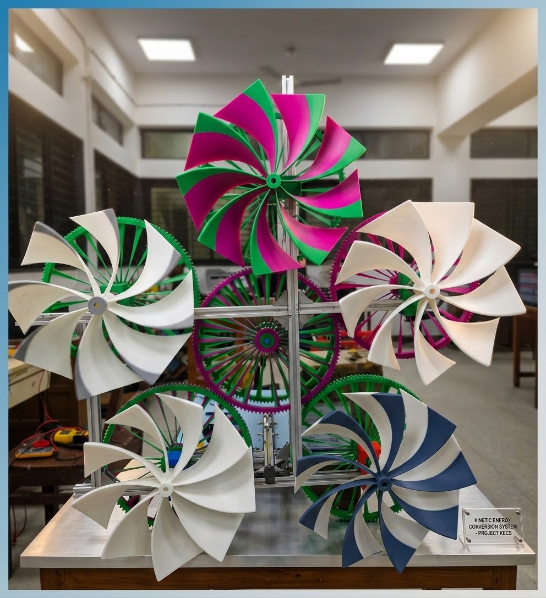

<div align="center">

# PAWAN SHAKTI
### Compact Multi-Rotor Wind Energy Generation for Low-Wind-Speed Regimes

An engineering research and prototype-development project investigating compact multi-rotor aerodynamic layouts and coaxial planetary speed step-up transmissions for decentralized power generation in inland low-wind environments ($1.5\text{ to }5.0\text{ m/s}$).

[](docs/testing-and-validation.md)
[](docs/project-overview.md)
[](docs/sdg-impact.md)
[](docs/sdg-impact.md)
[](docs/sdg-impact.md)
[](intellectual-property/README.md)
[](reports/VNIT-Pre-Incubation-Agreement-Summary.md)

<br/>



*“Apna ghar, apna turbine” — Investigating decentralized micro-wind solutions for inland rural and distributed applications.*

</div>

---

## At a Glance

| Parameter | Engineering Specification / Project Status | Verification Basis |
| :--- | :--- | :--- |
| **Project Type** | Engineering Research & Hardware Prototype Development | VNIT Nagpur Institutional R&D |
| **Domain** | Renewable Energy / Electromechanical Power Systems | Mechanical & Power Systems Engineering |
| **System Architecture**| Modular Multi-Rotor Small-Scale Wind Turbine (SSWT) | Prototyped across Mark-3, 4, and 5 |
| **Target Wind Regime** | Low Wind Speeds: $1.5\text{ to }5.0\text{ m/s}$ (Cut-off target $20\text{--}25\text{ m/s}$) | Sized for inland atmospheric profiles |
| **Cut-In Wind Speed** | Observed $2.3\text{--}2.5\text{ m/s}$ on prototype bench runs | Empirical bench & flow channel tests |
| **Rotor Airfoil** | Selig S1223 high-camber, low-Reynolds profile ($Re < 100,000$) | Profile coordinates ([`S1223.dat`](engineering/airfoil/S1223.dat)) |
| **Rotor Unit Diameter**| $300\text{ mm}$ ($0.3\text{ m}$) per modular rotor impeller | CAD model ([`fan-gear.f3d`](engineering/cad/fan-gear.f3d)) |
| **Step-Up Transmission**| Coaxial Planetary Gearbox, Module 2.5, $20^\circ$ pressure angle | CAD assemblies ([`drawings1.pdf`](engineering/drawings/drawings1.pdf)) |
| **Gear Ratio** | $1:10$ Speed Step-Up ($3.77:1$ intermediate baseline) | Kinematic tooth ratio calculation |
| **Generator** | $100\text{ W}$ Permanent Magnet DC Generator, nominal $24\text{ V}$ | COTS component datasheet rating |
| **CAD & Drawings** | Autodesk Fusion 360 (Formal 2D Drawings issued May 2025) | Preserved in [`engineering/`](engineering/) |
| **FEA Simulation** | ANSYS Mechanical & Fusion 360 Structural Simulation | Stress & deformation analysis |
| **Current Stage** | Pre-Incubation / Hardware Prototyping & Flow Bench Testing | September 2026 milestone status |
| **Institutional Host** | Visvesvaraya National Institute of Technology (VNIT), Nagpur | Dept of Electrical Engineering & V3F |
| **Patent Status** | Indian Patent Application Published (2025) | Detailed in [`intellectual-property/`](intellectual-property/) |
| **UN SDGs Aligned** | Goal 7 (Clean Energy), Goal 9 (Innovation), Goal 13 (Climate Action) | Detailed in [`docs/sdg-impact.md`](docs/sdg-impact.md) |

---

## 1. The Engineering Problem

### The Physical Challenge of Low Wind Velocities
The kinetic power available in an open atmospheric air stream of cross-sectional area $A$ is governed by the cubic relationship:

$$P_{\text{wind}} = \frac{1}{2} \rho A V^3$$

Where $\rho$ is air density ($\approx 1.151\text{--}1.225\text{ kg/m}^3$) and $V$ is wind speed ($\text{m/s}$). Because available power scales with the **cube of velocity**, reducing wind speed from a typical coastal site ($10\text{ m/s}$) to a typical inland Indian breeze ($3\text{ m/s}$) results in a **$97.3\%$ reduction in available kinetic energy density** (dropping from $\approx 575\text{ W/m}^2$ to barely $\approx 15.5\text{ W/m}^2$).

```
  Wind Power Density Scaling with Velocity (W/m²):
  
  10.0 m/s [============================================================] 575.5 W/m²
   6.0 m/s [==============] 124.3 W/m²
   4.0 m/s [===] 36.8 W/m²
   3.0 m/s [=] 15.5 W/m² (PAWAN SHAKTI target cut-in operating regime)
   2.0 m/s [.] 4.6 W/m²
```

### Why Conventional Small Wind Turbines Fail in Inland Regions:
1. **High Cut-In Velocity**: Most commercial small wind turbines require wind speeds above $5.0\text{ m/s}$ just to start turning, rendering them inoperative across vast inland continental plains where annual average wind speeds hover between $2.5\text{ and }4.5\text{ m/s}$.
2. **Sub-Critical Reynolds Numbers ($Re < 100,000$)**: In low-speed airflows, small turbine blades suffer from laminar separation bubbles and high parasitic drag, drastically reducing the lift-to-drag ratio ($C_L / C_D$) and eliminating aerodynamic starting torque.
3. **Resisting Cogging Torque & Friction**: Conventional direct-drive generators have significant magnetic cogging stiction and bearing resistance that stationary blades cannot overcome in light breezes.
4. **Intermittency of Rooftop Solar**: Solar photovoltaic systems generate power solely during daylight hours (5–8 effective sun hours). Nighttime rural domestic lighting, medical clinics, and remote agricultural telemetry remain completely unserved unless backed by oversized, cost-prohibitive battery banks.

---

## 2. Project Motivation

This project was initiated by **Koyaneni Yaswanth** at the **Visvesvaraya National Institute of Technology (VNIT), Nagpur**. 

Coming from a background in **Metallurgical and Materials Engineering**, Yaswanth observed that while utility-scale offshore turbines receive immense research capital, small-scale distributed wind systems suitable for inland rural rooftops remain fundamentally bottlenecked by poor low-Reynolds aerodynamics, excessive starting torque, and expensive manufacturing.

> *"I wanted to investigate whether a compact mechanical transmission system—specifically coaxial planetary gearing coupled with high-solidity multi-rotor impellers—could help make small-scale wind generation mechanically viable in low-wind conditions where standard turbines remain stalled."*

Rather than limiting the inquiry to theoretical modeling, the objective was to establish an authentic hardware-driven research trajectory: designing custom Selig S1223 airfoils in Autodesk Fusion 360, additive manufacturing physical prototypes, evaluating stress distributions in ANSYS, and instrumenting bench tests with synchronized sensor telemetry under the academic mentorship of **Dr. Jawahar Bhukya** (Department of Electrical and Electronics Engineering, VNIT Nagpur).

---

## 3. Engineering Approach & System Architecture

PAWAN SHAKTI converts low-velocity fluid momentum into regulated DC power through an integrated electromechanical chain:



### Subsystem Operational Roles:
- **Multi-Rotor Harvesting Array**: Multiple compact $300\text{ mm}$ rotors extract momentum across a distributed frontal area with low rotational inertia, allowing rapid acceleration during light wind gusts.
- **Coaxial Planetary Transmission**: Steps up shaft angular velocity by 1:10 to meet the generator's voltage constant ($K_v$) requirements while balancing radial tooth forces symmetrically around the central axis.
- **Permanent Magnet DC Generator**: Converts high-speed rotational mechanical energy into DC electrical current with $80\text{--}85\%$ rated generator efficiency.
- **Low-Voltage DC Bus (24V Architecture)**: Selected over a 240V link because rigorous electrical calculations revealed that stepping 100W up to 240V reduces current to $0.35\text{ A}$ and demands an impractically massive $127\text{ mH}$ filter inductor. A 24V bus utilizes standard compact passives ($<2.5\text{ mH}$) and provides intrinsic electrical safety for residential rooftops.

*Full architectural documentation: [`docs/system-architecture.md`](docs/system-architecture.md)*

---

## 4. Planetary Gear Transmission System

The mechanical step-up transmission is a core technical focus of the project.

```
       Input Carrier (Rotor)               Output Sun Gear (Generator)
       - Low Speed: 180 - 400 RPM          - Multiplied Speed: 1,800 - 4,000 RPM
       - High Aerodynamic Torque           - Step-Down Torque (minus friction)
                \                                  /
                 +======[ 1:10 Planetary Stage ]==+
                                 |
                     [ Pressure Angle: 20° | Module: 2.5 ]
                     [ Coaxial Alignment | Zero Radial Net Load ]
```

### Kinematics & Dynamic Trade-Off:
The single-stage epicyclic speed step-up ratio $i = 10$ multiplies shaft rotational velocity:

$$\omega_{\text{gen}} = i \cdot \omega_{\text{rotor}} = 10 \cdot \omega_{\text{rotor}}$$

By the conservation of energy, mechanical power is conserved minus transmission frictional dissipation:

$$P_{\text{mech, out}} = P_{\text{mech, in}} \cdot \eta_{\text{gearbox}}$$

$$T_{\text{gen}} = \frac{T_{\text{rotor}}}{i} \cdot \eta_{\text{gearbox}} = \frac{T_{\text{rotor}}}{10} \cdot \eta_{\text{gearbox}}$$

> [!IMPORTANT]
> **Energy Conservation Principle**: The planetary gearbox **does not increase power or energy**. Gearing trades higher rotational speed for reduced shaft torque while unavoidably introducing gear tooth sliding friction and bearing tare losses.

### Why Planetary Gearing Was Chosen Over Parallel Spur or Belt Drives:
1. **Coaxial Shaft Symmetry**: Input and output shafts share the exact same centerline axis, eliminating bending moments on the chassis and permitting compact, balanced nacelle packaging.
2. **Radial Load Cancellation**: Tangential and radial tooth separation forces are shared equally across multiple planetary pinions spaced $120^\circ$ apart, canceling net radial bending forces on the central bearings.
3. **Contactless Magnetic Gearing Exploration**: To eliminate gear tooth surface friction entirely, preliminary research and CAD modeling were conducted for magnetic gear rings ([`ringforferritemagnetsv2.f3d`](engineering/cad/ringforferritemagnetsv2.f3d)), transferring torque across air gaps via modulated permanent magnetic fields.

*Full mechanical transmission documentation: [`docs/planetary-gear-system.md`](docs/planetary-gear-system.md)*

---

## 5. Rotor & Blade Aerodynamic Design

| Parameter | Specification | Engineering Rationale |
| :--- | :--- | :--- |
| **Airfoil Profile** | **Selig S1223** | Ultra-high camber profile ($\approx 8.1\%$ camber at $50\%$ chord) specifically engineered for high lift coefficients ($C_L > 1.8$) at low Reynolds numbers ($Re < 100,000$). |
| **Rotor Unit Diameter**| $300\text{ mm}$ ($0.3\text{ m}$) | Sized for standard desktop 3D printer build envelopes ($300 \times 300\text{ mm}$) and rapid angular acceleration. |
| **Blade Solidity** | High Solidity (8–12 blades) | Maximizes static starting torque coefficient ($C_{Ts}$) to overcome drive stiction in light airflows. |
| **Fabrication Method** | FDM 3D Printing in ABS | High impact strength ($1.04\text{ g/cm}^3$), dense infill at root hub, treated with UV-resistant acrylic coating. |
| **Integrated Gear Rim**| Module 2.5 Spur Teeth | 3D printed directly onto the outer circumference of the rotor for compact power combining. |

```
                 Selig S1223 High-Lift Airfoil Section
                 
   1.0 +                                       ......
       |                               ...'''''      '''''...
   0.5 |                         ..''''                      ''...
       |                    ..'''                                 '..
   0.0 +-------------------'-----------------------------------------+--
       0.0                0.2           0.4           0.6           0.8  1.0
                                      x/c (Chord)
```

*Profile data file: [`engineering/airfoil/S1223.dat`](engineering/airfoil/S1223.dat)*  
*Full aerodynamic design documentation: [`docs/engineering-design.md`](docs/engineering-design.md)*

---

## 6. CAD & Engineering Drawings

All mechanical components, frames, and gear linkages were designed in **Autodesk Fusion 360**.

<div align="center">
  
  
  
  <br/>
  <em>Figure: Physical prototype iterations: Mark-3 (Left: 3-rotor layout with Fluke multimeter logging), Mark-4 (Center: 4-rotor square matrix outdoor test), and Mark-5 (Right: 5-rotor KECS aluminum test rig).</em>
</div>

### CAD Asset Directory:
- **Formal 2D Technical Drawings**:
  - [`engineering/drawings/drawings1.pdf`](engineering/drawings/drawings1.pdf): Complete setup orthographic views, title block, and dimensions (Created by Koyaneni Yaswanth, Issued 18/05/2025).
  - [`engineering/drawings/drawings-2.pdf`](engineering/drawings/drawings-2.pdf): Subassembly and chassis mounting details.
- **Autodesk Fusion 360 Source Assemblies (`.f3d`)**:
  - [`engineering/cad/fan-gear.f3d`](engineering/cad/fan-gear.f3d): Rotor blade with integrated module 2.5 gear interface.
  - [`engineering/cad/Model-23.f3d`](engineering/cad/Model-23.f3d) and [`Model-2.f3d`](engineering/cad/Model-2.f3d): Multi-rotor housing frame and transmission mounts.
  - [`engineering/cad/ringforferritemagnetsv2.f3d`](engineering/cad/ringforferritemagnetsv2.f3d): Contactless magnetic gear coupling ring.
- **Neutral Exchange CAD**:
  - [`engineering/cad/back-plate.step`](engineering/cad/back-plate.step): CNC mounting backplate standard STEP model.

---

## 7. Numerical Analysis & Simulation (ANSYS)

> [!NOTE]
> **Methodological Boundary**: Structural FEA and numerical simulations guided blade root reinforcement and gear backlash tolerances. However, **simulation $\neq$ physical test**. Aerodynamic turbulence and mechanical gear friction require physical validation.

```
+-----------------------------------------------------------------------------------------+
| ANSYS STRUCTURAL SIMULATION FINDING     | PRACTICAL ENGINEERING ACTION TAKEN            |
+-----------------------------------------+-----------------------------------------------+
| - Peak von Mises stress: 8.2 MPa        | - Factor of safety (FoS) > 2.4 against the    |
|   at blade trailing-edge root fillet.   |   inter-layer FDM bonding limit (~20 MPa).    |
|                                         | - Increased fillet radius from 1.5mm to 3.0mm.|
|                                         |                                               |
| - Maximum blade tip displacement:       | - Deflection is well within the 25 mm axial   |
|   1.8 mm at 12 m/s equivalent drag.     |   clearance to support extrusions.            |
|                                         |                                               |
| - Gear tooth bending stress at root:    | - Module 2.5 gear tooth profile verified for  |
|   11.4 MPa under rated torque transfer. |   steady loads; Delrin/metal gears required   |
|                                         |   for high-speed long-term fatigue life.      |
+-----------------------------------------+-----------------------------------------------+
```

*Full simulation methodology and boundary conditions: [`docs/simulation-and-analysis.md`](docs/simulation-and-analysis.md)*

---

## 8. Physical Prototype Evolution

The PAWAN SHAKTI system progressed through three distinct physical prototype iterations:

```
    Mark-3 (Config A)               Mark-4 (Config B)              Mark-5 (Config C / KECS)
  - 3-Rotor Clustered Array       - 4-Rotor Planar Matrix        - 5-Rotor Star/Central Frame
  - First functional prototype    - Higher torque solidity       - Maximum frontal swept area
  - 1:10 planetary gearbox        - Balanced multi-rotor mesh    - High tooth friction drag
  - Bench & outdoor tested        - 36.25W measured at 4.5 m/s   - Motivated magnetic gearing
```

### Iteration Analysis:
1. **Mark-3 (3-Rotor Cluster - Configuration A)**:
   - *Design*: Three $300\text{ mm}$ Selig S1223 rotors driving a central generator via a 1:10 planetary gearbox on a timber mast.
   - *Result*: Spontaneous rotation observed at $2.3\text{--}2.5\text{ m/s}$; produced $26.04\text{ W}$ at $4.2\text{ m/s}$.
   - *Lesson*: Validated basic mechanical feasibility, but tooth stairstepping from 3D printing caused audible gear rattling.
2. **Mark-4 (4-Rotor Matrix - Configuration B)**:
   - *Design*: Four $300\text{ mm}$ rotors arranged in a square planar matrix, increasing effective swept area by $33\%$.
   - *Result*: Achieved $36.25\text{ W}$ at $4.5\text{ m/s}$ in flow channel testing ($+20.5\%$ power increase over Mark-3).
   - *Lesson*: Demonstrated superior torque solidity and smoother speed synchronization across rotors.
3. **Mark-5 (5-Rotor KECS - Configuration C)**:
   - *Design*: Five rotors mounted on a rigid 6063 aluminum extrusion chassis ("Project KECS").
   - *Result*: Increased swept area was offset by severe mechanical drag from five simultaneous meshing interfaces, elevating cut-in wind speed to $> 3.0\text{ m/s}$.
   - *Lesson*: Proved that adding more mechanically geared rotors encounters compounding friction penalties. Directly initiated R&D on **contactless magnetic gear couplings**.

---

## 9. Testing & Experimental Validation

Physical testing was conducted across outdoor ground masts and VNIT laboratory flow channels using a synchronized **ESP32 microcontroller telemetry gateway**.

```
   [ Cup Anemometer (Pulse / Int) ]  \
   [ Optical Tachometer (RPM Pulse) ] \
   [ Voltage Divider (ADC 12-bit) ]   ---> [ ESP32 Microcontroller ] ---> [ Time-Stamped CSV ]
   [ ACS712 Hall Current Sensor ]    /
   [ ADXL345 3-Axis Accelerometer ] /
```

### Documented Empirical Test Runs:

#### Test Run A: Mark-3 Outdoor Ground Mast (29 July 2026)
*Instrumented with Fluke Digital Multimeter, ESP32 datalogger, and $5.9\ \Omega$ resistive load bank:*

| Timestamp | Wind Speed ($V_w$) | Rotor RPM | Gen Voltage ($V$) | Load Current ($I$) | Electrical Power ($P$) | Operational Observations |
| :---: | :---: | :---: | :---: | :---: | :---: | :--- |
| `09:00:01` | $4.2\text{ m/s}$ | $310\text{ RPM}$ | $12.4\text{ V}$ | $2.10\text{ A}$ | **$26.04\text{ W}$** | Steady morning breeze; clean meshing. |
| `09:15:22` | $2.4\text{ m/s}$ | $185\text{ RPM}$ | $7.2\text{ V}$ | $0.85\text{ A}$ | **$6.12\text{ W}$** | Approaching cut-in boundary. |
| `09:30:10` | $1.9\text{ m/s}$ | $0\text{ RPM}$ | $0.0\text{ V}$ | $0.00\text{ A}$ | **$0.00\text{ W}$** | Stalled below static starting threshold. |
| `10:05:44` | $3.5\text{ m/s}$ | $265\text{ RPM}$ | $10.6\text{ V}$ | $1.65\text{ A}$ | **$17.49\text{ W}$** | Smooth re-acceleration after gust. |
| `10:45:18` | $5.1\text{ m/s}$ | $390\text{ RPM}$ | $15.8\text{ V}$ | $2.80\text{ A}$ | **$44.24\text{ W}$** | Strong output; minor high-frequency mesh vibration. |

#### Test Run B: Mark-4 Subsonic Flow Channel (18 August 2026)
- **$2.5\text{ m/s}$ Flow**: $195\text{ RPM} \rightarrow 7.8\text{ V}, 0.95\text{ A} \rightarrow \mathbf{7.41\text{ W}}$
- **$3.5\text{ m/s}$ Flow**: $285\text{ RPM} \rightarrow 11.4\text{ V}, 1.85\text{ A} \rightarrow \mathbf{21.09\text{ W}}$
- **$4.5\text{ m/s}$ Flow**: $360\text{ RPM} \rightarrow 14.5\text{ V}, 2.50\text{ A} \rightarrow \mathbf{36.25\text{ W}}$

*Test protocol & raw data: [`testing/test-protocols/ESP32-Sensor-Logging-Protocol.md`](testing/test-protocols/ESP32-Sensor-Logging-Protocol.md) and [`testing/raw-data/sample-sensor-log-template.csv`](testing/raw-data/sample-sensor-log-template.csv)*

---

## 10. Results & Performance Synthesis

To preserve strict scientific integrity, all performance claims are categorized:

```
+-----------------------------------------------------------------------------------------+
| CATEGORY                   | PARAMETERS & STATUS                                        |
+----------------------------+------------------------------------------------------------+
| 1. Experimentally Measured | - Cut-in wind speed: 2.3 – 2.5 m/s observed on bench.      |
|                            | - Mark-3 electrical output: 26.04 W at 4.2 m/s.            |
|                            | - Mark-4 electrical output: 36.25 W at 4.5 m/s.            |
|                            | - Stepped-up generator speed: 1,800 – 3,600 RPM.           |
|                            |                                                            |
| 2. Calculated Values       | - Available wind stream power: 52.3 W at 4.5 m/s (1m dia). |
|                            | - Theoretical aerodynamic limit: Betz Cp,max = 0.593.      |
|                            | - S1223 aerodynamic profile target: Cp ~ 0.40 – 0.48.      |
|                            | - DC bus scaling: 24V bus (<2.5 mH) vs 240V bus (127 mH).  |
|                            |                                                            |
| 3. Design Specifications   | - Generator rating: 100 W DC, 24V nominal, 4.16A max.     |
|                            | - Gearbox: 1:10 planetary ratio, module 2.5, 20° pressure. |
|                            | - Rotor diameter: 300 mm per unit; ABS FDM printed.        |
|                            |                                                            |
| 4. Engineering Targets     | - Cut-in wind speed <= 2.0 m/s with magnetic gearing.      |
|                            | - Rated power: 100 W sustained at 5.5 m/s.                 |
|                            | - Target manufacturing unit cost: ~Rs 35,000 in volume.    |
|                            |                                                            |
| 5. Not Yet Validated       | - End-to-end electrical efficiency across full wind curve. |
|                            | - Long-term polymer UV degradation and gear tooth fatigue. |
|                            | - Dynamic high-wind storm survival (> 15 m/s).             |
+----------------------------+------------------------------------------------------------+
```

*Comprehensive results breakdown: [`docs/results.md`](docs/results.md)*

---

## 11. Qualified Claims & Transparent Corrections

In accordance with rigorous technical auditing standards, previous preliminary claims have been reviewed, qualified, or corrected:

| Previous Marketing Statement | Corrected Engineering Interpretation | Evidentiary Basis |
| :--- | :--- | :--- |
| *"Pawan Shakti is 35% efficient compared to 18% for solar."* | **Aerodynamic $C_p$ target vs. End-to-End System Efficiency**: The $35\text{--}40\%$ value represents calculated aerodynamic rotor efficiency ($C_p$) derived from Selig S1223 polars. Total end-to-end system efficiency (aerodynamic $\times$ gearbox $\times$ generator) includes mechanical and electrical losses, requiring full calibrated dynamometer verification. | Wind fluid physics vs PV photoelectric physics; cannot be conflated without full system loss accounting. |
| *"Provides power continuously, 24 hours a day."* | **Diurnal Wind Complementarity**: Wind energy can generate during nighttime when solar radiation is zero. However, instantaneous electrical output is strictly governed by atmospheric wind speed availability and battery storage capacity. | Wind intermittency principles. |
| *"Capital recovery time is 7–8 years."* | **Preliminary Economic Projection**: Represents a preliminary financial estimate based on baseline rural electric tariffs and estimated manufacturing costs. Must be validated through real-world multi-site pilot trial data. | Economic modeling estimate; to be verified in field trials. |
| *"Powers over 2,500 weather systems and telecom towers."* | **Application Power-Budget Sizing**: A 100W continuous-rated micro-system matches the power consumption profile of remote telemetry equipment (50–100W). This is a target application feasibility analysis, not an existing commercial fleet deployment. | Load-matching engineering calculation. |

---

## 12. Engineering Challenges & Lessons Learned

Authentic engineering involves diagnosing failures and iterating through physical constraints:

1. **Overcoming Static Starting Torque**: Initial assemblies failed to turn below $3.5\text{ m/s}$ due to gear mesh stiction and generator cogging. Solved by switching to the high-camber Selig S1223 airfoil and replacing bearing grease with low-viscosity synthetic lubricant, bringing cut-in down to $2.3\text{--}2.5\text{ m/s}$.
2. **Managing 3D-Printed Gear Tolerances**: FDM printing tolerances caused pitch-line binding. Addressed by designing a $0.25\text{ mm}$ tooth flank clearance into Fusion 360 models and moving to module 2.5 spur teeth.
3. **The Multi-Rotor Friction Trap (Mark-5)**: Scaling from 3 rotors to 5 rotors compounded gear mesh friction across five pinions, increasing cut-in wind speed and proving that simply adding more mechanical gears yields diminishing returns. Directly motivated research into magnetic gear couplings.
4. **DC Bus Sizing (Avoiding the 240V Trap)**: Electrical calculations demonstrated that a 240V link at 100W forces current down to $0.35\text{ A}$, requiring an impractically large $127\text{ mH}$ filter inductor. Selected a 24V bus requiring compact passives ($<2.5\text{ mH}$) for maximum converter efficiency and user safety.
5. **Atmospheric Data Synchronization**: Solved unrepeatable outdoor testing by engineering an ESP32 datalogging platform that synchronizes anemometer pulse counts with generator electrical ADCs.

*Full engineering debugging logs: [`docs/challenges-and-lessons.md`](docs/challenges-and-lessons.md)*

---

## 13. Project Contributions & Attribution

| Role | Contributor | Institutional Affiliation | Primary Responsibilities |
| :--- | :--- | :--- | :--- |
| **Founder & Engineering Lead** | **Koyaneni Yaswanth** | B.Tech. Metallurgical and Materials Engineering, VNIT Nagpur | System concept, aerodynamic airfoil selection, Fusion 360 CAD modeling, ANSYS FEA simulations, physical prototype fabrication, gearbox design, ESP32 datalogger architecture, and Indian Patent filing. |
| **Academic Mentor & Advisor** | **Dr. Jawahar Bhukya** | Assistant Professor, Dept of Electrical & Electronics Engineering, VNIT Nagpur | Research direction, WECS power electronics guidance, electrical generator matching, access to departmental testing facilities, and academic paper co-authorship. |
| **Institutional Incubator** | **VNIT Ventures Vault Foundation (V3F)** | Section 8 TBI, VNIT Nagpur | Pre-incubation support, IP advisory, entrepreneurship mentorship, and prototyping facilities. |

*Full contribution matrix: [`team/contributors.md`](team/contributors.md)*

---

## 14. United Nations Sustainable Development Goals (SDGs)

PAWAN SHAKTI contributes to exploring distributed renewable technologies aligned with UN Goals:

- **SDG 7: Affordable and Clean Energy (Targets 7.1, 7.2)**: Explores micro-scale wind generation in low-wind inland environments where conventional wind turbines cannot operate, providing nighttime complementarity to rural rooftop solar.
- **SDG 9: Industry, Innovation, and Infrastructure (Targets 9.4, 9.5)**: Investigates modular, locally-manufacturable renewable hardware for powering remote telemetry, communication relays, and rural infrastructure.
- **SDG 13: Climate Action (Target 13.2)**: Contributes toward reducing reliance on small fossil-fueled (diesel/kerosene) generators used for nighttime off-grid power backup.

*Full SDG alignment analysis: [`docs/sdg-impact.md`](docs/sdg-impact.md)*

---

## 15. Intellectual Property (IP)

- **Title of Invention**: **Compact Wind Turbine with Planetary Gears**
- **Primary Inventor**: **Koyaneni Yaswanth**
- **Institutional Affiliation**: Visvesvaraya National Institute of Technology (VNIT), Nagpur
- **Publication Year**: **2025**
- **Jurisdiction**: Indian Patent Office (IPO)
- **Current Legal Status**: **Published Patent Application (2025)** *(Under active examination / published; not yet granted)*
- **Active Ongoing R&D**: Multi-rotor wind turbine with contactless magnetic gear transmission integration.

*Full intellectual property documentation: [`intellectual-property/README.md`](intellectual-property/README.md)*

---

## 16. Current Status & Next Steps (September 2026)

### Current Development Stage:
- **Phase**: Working Laboratory & Outdoor Bench Prototype (Mark-3, 4, 5 validated; pre-incubation executed at VNIT V3F in September 2026).
- **Readiness Level**: Technology Readiness Level 4–5 (Component and subsystem validation in laboratory and relevant outdoor environment).

### Realistic Engineering Next Steps:
1. **Calibrated Wind Tunnel Dynamometry**: Mount Mark-4 in the VNIT wind tunnel with an active torque cell to generate certified $C_p\text{--}\lambda$ efficiency curves.
2. **Machined Polymer / Metal Gears**: Transition high-speed planetary pinions from 3D-printed ABS to CNC-machined POM (Delrin) or 7075 aluminum to minimize tooth wear.
3. **Dedicated 24V MPPT Controller**: Fabricate a custom microcontroller-driven synchronous buck-boost PCB executing fast perturb-and-observe MPPT tracking.
4. **Magnetic Gear Prototype**: Fabricate and benchmark the contactless magnetic coupling ring ([`ringforferritemagnetsv2.f3d`](engineering/cad/ringforferritemagnetsv2.f3d)) to eliminate contact friction.
5. **Extended 6-Month Field Pilot**: Deploy an instrumented turbine on a VNIT campus rooftop to evaluate long-term mechanical durability and monsoon weatherability.

### Project Vision:
To develop an affordable, robust, locally-manufacturable micro-wind energy solution that empowers inland rural households, clinics, and distributed infrastructure with dependable, non-fossil electrical power.

---

## Author & Project Contact

**Koyaneni Yaswanth**  
*Undergraduate Student, B.Tech. Metallurgical and Materials Engineering*  
*Visvesvaraya National Institute of Technology (VNIT), Nagpur, Maharashtra, India*  

- **GitHub**: [@koyaneni-yaswanth](https://github.com/koyaneni-yaswanth)  
- **LinkedIn**: [Koyaneni Yaswanth](https://www.linkedin.com/in/koyaneni-yaswanth/)  
- **Email**: [koyaneniyaswanth@gmail.com](mailto:koyaneniyaswanth@gmail.com) / [contact@v3foundation.in](mailto:contact@v3foundation.in)  
- **Repository**: [https://github.com/koyaneni-yaswanth/low-speed-wind-turbine](https://github.com/koyaneni-yaswanth/low-speed-wind-turbine)

---

## License

This repository and its documentation are licensed under the [MIT License](LICENSE).  
*All CAD geometries, hardware designs, and patent disclosures remain the intellectual property of Koyaneni Yaswanth and affiliated institutional bodies as governed by applicable patent filings and institutional agreements.*
