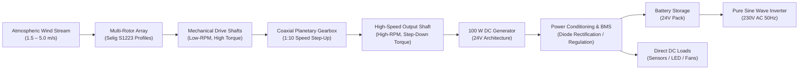

# System Architecture

## End-to-End Energy Conversion Chain

The PAWAN SHAKTI system is designed as a modular electromechanical architecture converting kinetic fluid energy into regulated direct-current (DC) power for decentralized storage and utilization.



---

## Subsystem Functional Breakdown

### 1. Aerodynamic Harvesting Subsystem
- **Core Component**: Multi-propeller rotor cluster (tested in 3-rotor, 4-rotor, and 5-rotor configurations).
- **Aperture Diameter**: $300\text{ mm}$ ($0.3\text{ m}$) per single rotor unit; clustered effective swept footprint of $\approx 1.0\text{--}1.2\text{ m}$.
- **Airfoil Section**: Selig S1223 high-camber profile, specifically optimized for high lift coefficient ($C_L \approx 1.8\text{--}2.1$) in low Reynolds regimes ($Re < 100,000$).
- **Function**: Extracts momentum from low-speed airflow, converting stream dynamic pressure into rotational mechanical power at relatively low rotational speeds ($150\text{--}400\text{ RPM}$).

### 2. Mechanical Transmission Subsystem
- **Core Component**: Coaxial planetary gear system (spur configuration, module 2.5, $20^\circ$ pressure angle).
- **Gear Ratio**: 1:10 single-stage step-up (also evaluated with 3.77:1 intermediate ratio in scaled electrical models).
- **Arrangement**: Central sun gear driven by planetary cluster, coaxially coupled to minimize bending moments and radial bearing loads.
- **Function**: Steps up rotational speed by a factor of 10 to match the operating voltage-speed constant ($K_v$) of standard small DC generators, while trading off shaft torque and absorbing transmission frictional losses.

### 3. Electromechanical Conversion Subsystem
- **Core Component**: 100 W brushed/brushless DC generator.
- **Nominal Ratings**: $24\text{ V DC}$, rated current $4.16\text{ A}$ (with supplementary high-voltage tests conducted on $110\text{ V DC} / 3500\text{ RPM}$ motor-generators).
- **Conversion Efficiency**: $80\text{--}85\%$ at rated shaft angular velocity.
- **Function**: Converts high-speed mechanical shaft rotation into direct-current electrical output through electromagnetic induction.

### 4. Power Conditioning, Storage & Load Subsystem
- **Core Components**:
  - Schottky diode / bridge rectifier for bidirectional isolation.
  - Electronic Charge Controller with Battery Management System (BMS).
  - Energy Storage Pack: Nominal 24V DC battery bank (e.g., $24\text{ V}, 40\text{ Ah}$ lead-acid or LiFePO4).
  - Optional Pure Sine Wave Inverter: $24\text{ V DC} \rightarrow 230\text{ V AC}, 50\text{ Hz}$ for standard household appliances.
- **Function**: Stabilizes variable voltage generated under gusty wind conditions, protects battery from overcharge/deep discharge, and supplies power to DC or AC loads.

---

## Critical Engineering Trade-off: DC Bus Sizing (24V vs. 240V)

During the detailed electrical sizing of a 100 W micro-turbine, two architectural paths were calculated:

```
+-----------------------------------------------------------------------------------------+
|                               ELECTRICAL BUS SELECTION                                  |
+------------------------------------+----------------------------------------------------+
| High-Voltage DC Link (~240 V)      | Low-Voltage DC Bus (24 V / 48 V) [CHOSEN DESIGN]   |
+------------------------------------+----------------------------------------------------+
| - Stator power: ~77 W              | - Stator power: ~77 W                              |
| - Current: ~0.356 A                | - Current: ~3.2 A - 4.2 A                          |
| - Filter Inductor required: 127 mH | - Filter Inductor required: < 2.5 mH               |
| - High magnetic volume, bulky core | - Compact passive filtering, standard components   |
| - Difficult low-power switching    | - Readily available commercial charge controllers  |
| - Higher component dielectric cost | - Safe touch potential, ideal for rural homes      |
+------------------------------------+----------------------------------------------------+
```

As documented in the project calculation archives, attempting to step a 100 W generator directly to a high-voltage 240V DC link forces the electrical current down to fractions of an ampere ($I \approx 0.356\text{ A}$), requiring an impractically large filter inductor of **$127\text{ mH}$** and causing severe converter inefficiency. 

Therefore, the **24V DC bus** was selected as the baseline architecture for PAWAN SHAKTI, minimizing magnetic component mass, maximizing converter efficiency, and providing intrinsic electrical safety for residential rooftop deployment.
